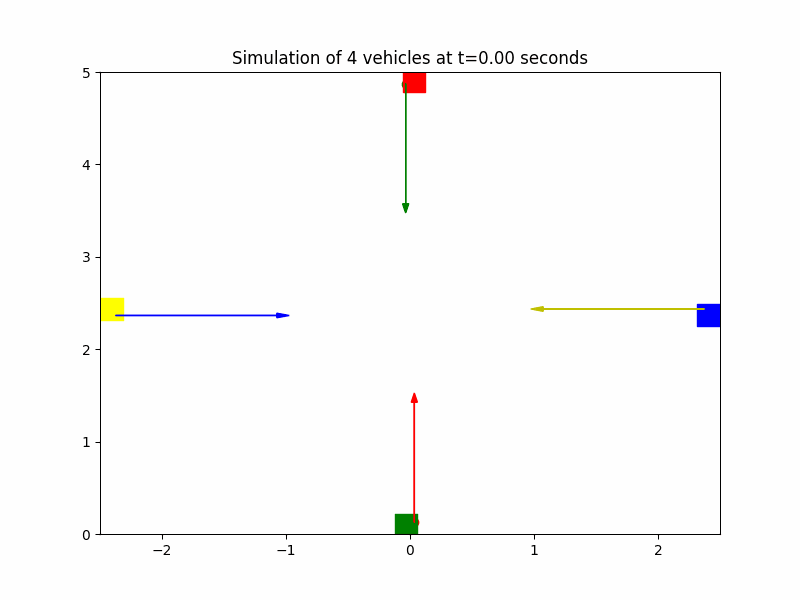
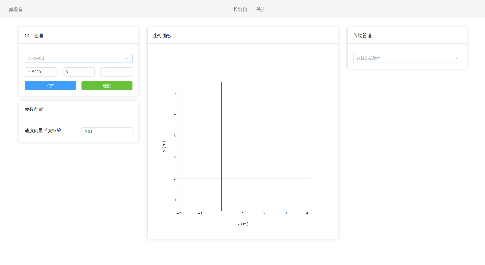

# IoTAGV


应用 UWB 通信技术，构建去中心化的多车定位及车间通信系统，实现多车协同运动与自动防撞。

## 演示

### 仿真



### 实机

* 静态障碍物躲避


* 动态障碍物躲避


* 复杂障碍物躲避


### 文件结构

### 系统架构

TODO

### 文件结构

```
center_module: 主控模块
TODO.
```

## Memo

模块间连接与常用功能引脚接线快速查询：

* STM32 SWD Wires

| Pin | Desc |
| :--: | :--: |
| PA13 | SWDIO |
| PA14 | SWCLK |

* Center Module UART1 (with UWB Module)

| Pin | Desc |
| :--: | :--: |
| PA9 | USART1_TX |
| PA10 | USART1_RX |

* Center Module UART2 (with PC, debug)

| Pin | Desc |
| :--: | :--: |
| PA2 | USART2_TX |
| PA3 | USART2_RX |

## 使用手册

### 单车清单

* STM32F425IIB6
* STM32F405RGT6
* DWM1000套装
* 基站2个（天线）
* 车3个。
* 遥控器两个及以上
* STLink至少拿5个
* **充电宝**尽可能多
* 2.5mm螺丝刀*2
* 2.0mm螺丝刀*2


## 前端



# Contributors

<a href="https://github.com/Ethylene9160/IoTAGV/graphs/contributors">
  
</a>

# 附录

## 附1：接线说明

## UWB Module


## Center Module

* STLink2烧录

| Pin  | Describe |
| :--: | :------: |
| PA13 |  SWDIO   |
| PA14 |  SWCLK   |

* 与UWB Module的通信：使用*USART1*

| Pin  | Describe  |
| :--: | :-------: |
| PA9  | USART1_TX |
| PA10 | USART1_RX |

* 与上位机的串口通信：使用*USART2*

| Pin  | Describe  |
| :--: | :-------: |
| PA2  | USART2_TX |
| PA3  | USART2_RX |

* 与屏幕的通信：使用I2C1

* 与IMU的通信：使用`I2C2`

## Controller Module

直插can总线通讯线。


## 附2 通信协议

* Center UWB -> UWB

|   位   |    0     |    1-2    |    3     |    4     |    5    |
| :----: | :------: | :-------: | :------: | :------: | :-----: |
|  内容  |   0x5A   |  pan_id   | dest_id  |  src_id  | task_id |
|  说明  | 同步帧头 |  网络ID   |  目标id  |   源id   | 任务id  |
| **位** |  **6**   |   **7**   |   8-11   |  12-15   |  ****   |
|  内容  | msg_type | ctrl_type | float f2 | float d2 |  0x7F   |
|  说明  | 消息类型 |           |          |          |  帧尾   |

* UWB -> UWB 全长64位

|  位  |    0     |  1-2   |   3   |    4    |   5    |
| :--: | :------: | :----: | :-----: | :-----: | :------: |
| 内容 |   0x5A   | pan_id | dest_id |  src_id  | task_id |
| 说明 | 同步帧头 |  网络ID  | 目标id  | 源id | 任务id |
|  **位**  | **6** |  7-7+len  |  | **** |****|
| 内容 | msg_type |  | float d1 |float d2|0x7F|
| 说明 | 消息类型 |    |   到基站0的距离   |到基站1的距离|帧尾|

* UWB -> Center

|  位  |    0     |  1-2   |   3-4   |    5    |   6-7    |
| :--: | :------: | :----: | :-----: | :-----: | :------: |
| 内容 |   0x5A   | src_id | dest_id |  CRC8（msg type）  | data_len |
| 说明 | 同步帧头 |  源id  | 目标id  | CRC校验 (消息类型) | 数据长度 |
|  **位**  | **8-11** |  **12-15**  | **16-19** | **20-23** |**24**|
| 内容 | float x | float y | float d1 |float d2|0x7F|
| 说明 | x坐标  |  y坐标  |   到基站0的距离   |到基站1的距离|帧尾|

第五位消息msg type类型解析：

> 0：默认。用于位置更新。
>
> 1：默认。用于坐标更新。

* Center -> 远程上位机

| 位 | 0-4 | 5 | 6-7 | 8 | 9 |10-13| 14-17|18|
| :--: | :--: | :--: | :--: | :--: | :--: |:-:|:-:|:-:|
|内容|0x5A|0xFF|uint16_t,10|msg_type|id|float f1|float f2|0x7F|
|说明|同步帧头|开始标记|长度，假设为10|消息类型|id|浮点数1|浮点数2|帧尾|


* 远程上位机 -> Center

| 位 | 0 | 1 | 2 | 3-7 | 8-11 |12|
| :--: | :--: | :--: | :--: | :--: | :--: |:-:|
| 内容 | 0x5A | msg_type | id | float f1 | float f2 |0x7F|
| 说明 | 帧头 | 消息类型 | id | 浮点数1  | 浮点数2         |帧尾|

