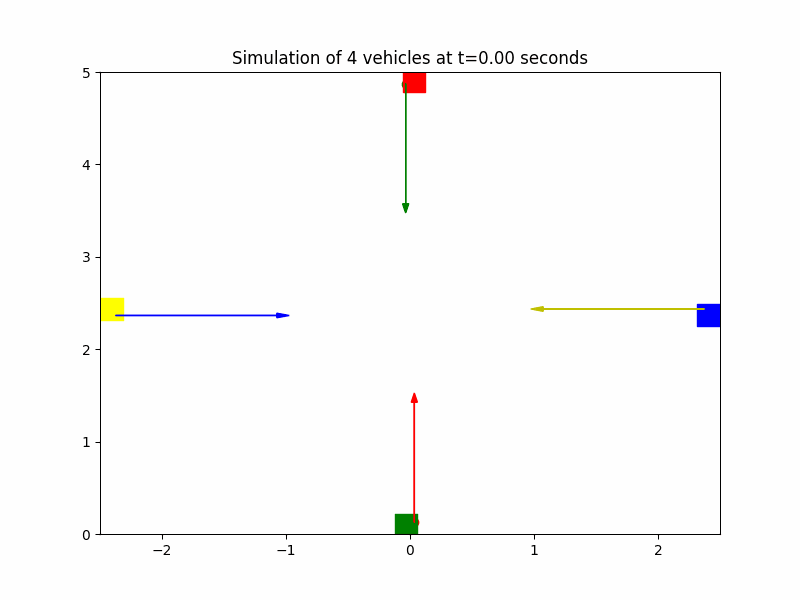

# IoTAGV

应用 UWB 通信技术，构建去中心化的多车定位及车间通信系统，实现多车协同运动与自动防撞。

## 演示

### 仿真



### 文件结构

### 系统架构

TODO

### 文件结构

```
center_module: 主控模块
TODO.
```

### Memo

模块间连接与常用功能引脚接线快速查询：

* STM32 SWD Wires

| Pin | Desc |
| :--: | :--: |
| PA13 | SWDIO |
| PA14 | SWCLK |

* Center Module UART1 (with UWB Module)

| Pin | Desc |
| :--: | :--: |
| PA9 | USART1_TX |
| PA10 | USART1_RX |

* Center Module UART2 (with PC, debug)

| Pin | Desc |
| :--: | :--: |
| PA2 | USART2_TX |
| PA3 | USART2_RX |

### 使用手册

TODO

### Contributors

<a href="https://github.com/Ethylene9160/IoTAGV/graphs/contributors">
  
</a>
